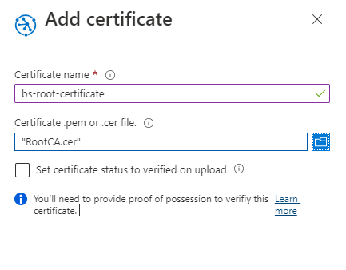
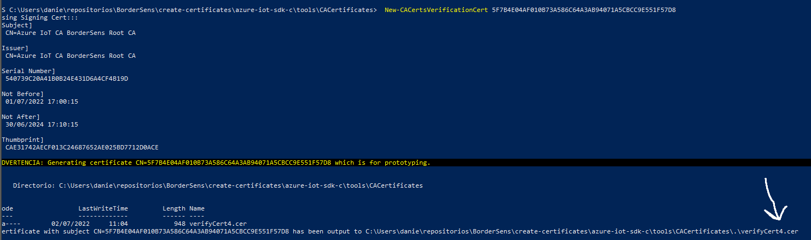
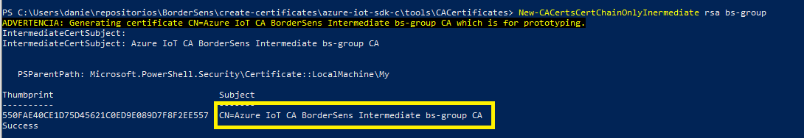

## Creación de certificados X509

Para mejorar la comprensión del uso de el uso de los certificados X509 en el patron de comunicaciones del proyecto y su uso en los servicios Azure IoT Hub y Azure IoT Hub Device Provisioning Service (DPS), es conveniente una breve introducción.

Existen 3 niveles de jerarquía en los certificados.

[]()

- **Certificado Root:** Solo existe un **certificado root** por cada servicio IoT Hub. Dicho certificado ya se ha creado, y se ha asociado con el servicio IoT Hub.

  Podemos encontrarlo en el siguiente enlace: [Certificado Root]() o en el [directorio de certificados]().

- Los **certificados intermedios** o intermediate son certificados, generados a partir del certificado root, y que sirven para firmar cualquier numero de certificados de dispositivo. Dentro del servicio [Azure IoT Hub Device Provisioning Service (DPS)](#Azure%20IoT%20Hub%20Device%20Provisioning%20Service%20(DPS)) permiten agrupar los dispositivos en grupos lógicos, bajo un único certificado firmante (el certificado intermedio). Esto para el proyecto tiene sentido por ejemplo en el caso de uso de un determinado aeropuerto, de forma que cada aeropuerto pueda generar su propio grupo, y asociar su propio certificado, y a partir de aquí, generar tantos certificados de dispositivo, como sean necesarios.

  Para poder usar un certificado intermedio, es necesario haberlo generado anteriormente, y asociarlo a un determinado grupo en el servicio  [Azure IoT Hub Device Provisioning Service (DPS)](#Azure%20IoT%20Hub%20Device%20Provisioning%20Service%20(DPS)), tal y como se describe en el documento [Creación de certificados X509 autofirmados]().

- Los **certificados de dispositivo** o leaf, son los certificados que identifican y autorizan inequívocamente a un determinado dispositivo en el servicio [Azure IoT Hub](#Azure IoT Hub). Estos certificados, han de haberse generado a partir de un certificado intermedio, perteneciente a un grupo, que se haya dado de alta como tal en el servicio [Azure IoT Hub Device Provisioning Service (DPS)](#Azure%20IoT%20Hub%20Device%20Provisioning%20Service%20(DPS)) .

En las siguientes secciones, se describirá como generar certificados y como asociarlos a los servicios de Azure

### Certificados

Se proporciona para el proyecto, certificados Root, intermediate y de dispositivo, por lo que si se desean usar estos, no hace falta generarlos, y se pueden omitir los siguientes pasos.

Pueden obtenerse del [directorio de certificados](./certificates).

### Windows

#### PASO 1: Configuración y primeros pasos

1. Descargar el repositorio de los scripts de creación de el certificado

```
git clone https://git.izertis.com/izertisidi/border_tec/bordersens-sdk.git
```

2. Iniciar PowerShell como administrador

3. Navegar en PowerShell hasta el directorio del repositorio de los Scripts

   ```
   cd ./bordersens-sdk/generación de certificados/Scripts
   ```

4. Establecer el valor de la variable de entrono OPENSSL_CONF en el directorio donde se encuentra el fichero de configuración de OpenSSL (openssl.cnf)

   ```powershell
   $Env:OPENSSL_CONF = "directorio de openssl.cnf"
   ```

5. Ejecutar  `Set-ExecutionPolicy -ExecutionPolicy Unrestricted` para que PowerShell pueda ejecutar los scripts.

   ```
   Set-ExecutionPolicy -ExecutionPolicy Unrestricted
   ```

6. Ejecutar `. .\ca-certs-bs.ps1` para traer las funciones del script al espacio de nombres global de PowerShell.

   ```powershell
   . .\ca-certs-bs.ps1
   ```

7. Opcional: Ejecutar `Test-CACertsPrerequisites`. Dado que PowerShell  usa el almacén de certificados de Windows para administrar certificados, esta invocación comprueba que no existan conflictos de nombres más adelante con los certificados existentes y que OpenSSL está creando.

#### PASO 2: Creación de los certificados

##### Certificado Root

El certificado Root es el certificado raíz, a partir del cual se generaran todos los certificados derivados. Solo puede haber uno, y este estará asociado al servicio Azure IoT Hub. El resto de certificados se generaran de forma directa o indirecta a partir de este.

Como ya se ha generado uno, y se ha asociado ya al servicio IoT Hub, **se recomienda no generar otro, y usar el ya generado y omitir este apartado**. El certificado Root (y el resto de certificados), se encuentran disponibles en el [directorio de certificados](./certificates).

1. Primero es necesario invocar la función para la creación de el **certificado Root**. Esto podemos hacerlo invocando al siguiente comando:

   ```
   New-CACertsCertChainOnlyRoot rsa
   ```

​		Es conveniente tener en cuenta los siguientes puntos:

- Se usara el fichero de configuración **openssl_root_ca.cnf**. Conviene prestar especial atención a **default_crl_days**  que indica el plazo de caducidad desde su emisión, y el apartado [ req_distinguished_name ], donde podemos personalizar los parámetros de emisión del certificado

  Una vez que hayamos generado el certificado, obtendremos los ficheros, en mismo directorio:

  - RootCA.cer
  - RootCA.pem

  ![](data:image/png;base64,iVBORw0KGgoAAAANSUhEUgAAAw0AAAAeCAIAAADhKWUfAAAAAXNSR0IArs4c6QAAAARnQU1BAACxjwv8YQUAAAAJcEhZcwAADsMAAA7DAcdvqGQAAAfYSURBVHhe7Z1LTiRJDIanTzCaOQMSW8QF6ga1A3EKhNhxiJY4AtvZ9yl6z4q7DBO24+EIOyKzOukcivilTyjLFY6HI8r+K6GKP15fXx8eHr5d3AIAAAAAAE3USf++/QMAAAAAADTQSQAAAAAAPtBJAAAAAAA+0Emn8f7j7vrvP/8iLp9+JOPb96crMt48l5aZn/eX1/ff5dq6vz8f+GHi6u7nGnfVzJ/SuKUZZQdslBbXrnGD7K59ZnRIy7HxjGSPIT28JIslh535lSC/vz3eeEO8HHO3ZU/DacdWAgA+FdBJJ8AZP+Z0rtCU/bmQhMxO5cTqJF0kXPfckoyhnh0fK0vlHoaI16HGSMHrT8m2dIy7MY5SwK5d47ovxnM2zGGTw+AYpT2JkuNBWywp8nRN7U9X2M2gAokks93xiD4fdj6cAAAwYEEnue/5poVqeaoT/MZX12xfAVR3g/ru9KwqSBntriF3LjPjPqPRFCTXuAO9KNm1s+5po9G4L659NiQ+URan4LhGuo7K0hExGr01WozydZsZrFEnEEIOrepHQ/bjI/1MkxxQek4nmQVZNOYpvRwvn57TrFZ0CwAADWvvJ/VS21RkeUE5+uru6agqRF3ClbEU+4F7gGpYrV0ad03oQXzHfYq9sfSMO+BGiex27XTeFnTS4trnhKKh1INrzJF0b/Zo9CHMAWcvLZ7o2jWmxtUQWq5pQv88pe6xz9BymgNDXknDqRHlbMhY4RonBABwKkUnURKUd10qqVFGi8Zid1tuNJ4FYebX94/53blOu00Jj8a6/G90z1AAU+of9Nm0HBv3wV+mZ3RpWo7XPiESHzkzIRqyy66RzgBb1ukkebUqmVWfTIm8awwXK3USDxTlEe8s7amLFmTFSMoszZOIDXAqAAAbGd1P0vloMZ/OAOX3dEu/qdnNw2SpsvnI3VQO6y40KmfQp6uHXONu2CiR0auaLk7QOmufE33TNwfEM9JPFhOFXujYhc6hCBGRLxT5LTpJTak2qin1j4Sbi8jdc4FOAgBsZK1OCunm7G7/fDiVcKyru63TNnH33N0a7+Z9q3J6fX5CkRRwouStnexUNeO6irFuPNiOOdFBy8FxjcWFLKPXNcc8uuTzU/WZrl0j92AHpX3UoioQOs/3kJpZ0ebWSi6ko+aGE7s4Bwk6CQCwkbV/x319f4f7SQEuABKTGI2Y9KOx2N0Ebd3J6NV46y6VwA7kTclp2XPfh16UevpGF1p62HP34jkzJGVSlPL5cY1Co0gsWidpLSLahVHb5BkDZQJJGzUbKre49Nz0+bc6qTrMuc9yGPA3SQCAD2Pt33GDk6CUveH2xkZ3AAAAAHwI0EkAAAAAAD7QSQAAAAAAPtBJAICJ+HZxCwAA64FOAgBMRJMBAQBgDHQSAGAimgwIAABjoJNOQ3322PnUuvsJ5OqLYYy7+ig1Yz7m5rurZv6Uxi3/jw/T2Sgtrl3jBtld+yQsBCQFs/kEvnyKvjaOQre+ZY/eVw/k7xwJ5CXwNwj83q1sMiAAAIyBTjqB6vtjqCBR9udCEjI7lRNdsQRdJFz33JKMQTfUX75Xu4ch4nWoMfGbkbtTsi0d426MoxSwa9e47ovx/MJ0AhIeuvs+Uh7rIk/XJGJOV9j6DGdIJJlB4/yfD7/1cDYZEAAAxizoJEpn5j3ftFBFSXVCvjqvLlFOiKq7QX13etarZ9pdQ+5yY2DYZzSaguQad6AXJbt21j1tNBr3xbV/eXrxDJQT4p0rTWg50CXaXYtRvm4zgzXqBELIlDqiluzHR/o5VGMivJ54xwPl9cW6WYwyejgh18cDTYn/TbLYmwwIAABj1t5P6qW2qci1h7J//Q/q3YrVlKiBe4Cqfq1dBhUu9CC+4z7F3lh6xh1wo0R2u3Y6bws6aXHtX55ePAN5i6WNqIfqN7NZVSyIknIIc8DZNxrzTrnG1LhKHVrgakL/Yc56RJc483om7JU0XBqRBqILah/kVOg//GwyIAAAjCk6iZJgTKYlqXGiEWOxuy03Gs+CMPMt//B/o3uGAqjuowz+Z75uOTbug79Mz+jStByvfQZ6oettcdINxtg/DzJEfMGm09icTIm8awwXK3USDxTlEe9svEtk0R3mCLAyS/MkWDzxlHJ76bbJgAAAMGZ0Pym/V0vXZyZrPhxKu/mWfl2ibMXSeT9aBu6mclh3oSmBgz7dYtmroPtgo0RGs/YeTtA6a58Ed9WDLXZfxfplbuEhWHOwEBH5QpHfopOoKzONRuj0j4TusJqecZEp5fbQSQCAX2CtTgpZ7+xu/3w4OiBNdbcVyybunrtb7dy8b0tgr89PKJICTpS8tZOdqmZcVzHWjQfbMQk2euMtpmeVlBHGoeMhYpBz53p38rVr5B7KNgky7WYmofN8D4ldSrahGSZB3DzLT9E1G9uDRM9CJwEAtrH277iv7+905poWLgASk5SpJelHY7Hn99Ma605Gr1BZd6kEdiBvSk7Lnvs+9KLUK9K60NLDnrsXzxlwA7K870maVMa+SArwQFrxxGMp2oVR2+QZAySwxF4mUM3/5pke6gOvz790Wx5Wyyz7rg5DXBQ5QicBALax9u+4wUlQyh6WnzEb3QH4wmTd09hX0mRAAAAYA50EADgnoJMAAHsCnQQAmIgmAwIAwJiokxorAAAAAMDsXNz+B3EuC73g4rStAAAAAElFTkSuQmCC)

2. Ahora debemos asociar el certificado a la instancia de IoT Hub, para ello:

   - Seleccionamos el **servicio de Azure IoT Hub Provisioning** del grupo de recursos de **BorderSensPlatform**

     

   - Vamos a la sección certificados, y pulsamos el botón añadir

     

     

   - Damos un nombre al certificado y adjuntamos el fichero **RootCA.cer** antes generado, manteniendo sin marcar la casilla de verificación, y pulsamos el botón **save**

     

   - Ahora vamos a verificar el certificado, para ello:

     - Seleccionamos el certificado que acabamos de crear, y pulsamos el botón **generate verification code**

       

       !
   
     - Desde la consola ejecutamos:
     
       ```
       New-CACertsVerificationCert 5F7B4E04AF010B73A586C64A3AB94071A5CBCC9E551F57D8
       ```

       Y obtenemos la siguiente salida

       

       Donde nos indica que se ha generado el fichero de verificación **verifyCert4.cer**, que adjuntaremos a la configuración de el certificado root

       

     - Ahora podemos ver que el estado de el certificado ha cambiado a verified, l cual implica que esta listo para ser usado
   
       


##### Certificados Intermediates

Los certificados intermediates, son los certificados creados a partir del certificado raíz, que permiten crear/agrupar certificados de dispositivo. En el caso de uso de BorderSens, pueden tener sentido para la gestión de certificados por parte de entidades organizativas, por ejemplo, un pais, una provincia, un aeropuerto... , de forma que cada unidad organizativa, solo tenga que conocer sus propios certificados intermedios, para generar los certificados de dispositivos.

Como ya se ha generado uno, y se ha asociado ya al servicio IoT Hub, **se recomienda no generar otro, y usar el ya generado y omitir este apartado**. El certificado Intermediate (y el resto de certificados), se encuentran disponibles en el [directorio de certificados](./certificates).

Desde el punto de vista de IoT Hub, podemos crear Enrollment Groups, o grupos de inscripción, que básicamente son conjuntos de dispositivos asociados a un mismo grupo, por ejemplo un determinado aeropuerto. 

Para crear los certificados intermedios tenemos que seguir los sigientes pasos:

1. ​	Generar el certificado intermedio ejecutando el siguiente comando:

   ```
   New-CACertsCertChainOnlyInermediate rsa nombre_certificado_intermedio
   ```

   Para el ejemplo creamos el certificado intermedio con nombre bs

   ```
   New-CACertsCertChainOnlyInermediate rsa bs-group
   ```

   Y veremos la siguiente salida

   

   El Comun Name marcado en la imagen, será usado para generar los certificados de dispositivo, así que debemos guardarlo

   Lo que genera el certificado **Intermediate1-bs-group.pem**

   ```
   ls
   
   -a----        01/07/2022     17:22           1326 Intermediate1-bs-group.pem
   ```

   

   2. Crear el enrollment Group en el servicio **Azure IoT Hub Device Provisioning Service (DPS)**

      - Desde el servicio **Azure IoT Hub Device Provisioning Service (DPS)** pulsamos el botón **Manage Enrollments** y el botón **+ Add enrolment group**

        

      - Y rellenamos los datos del formulario, especialmente los indicados en la imagen

        


##### Certificados de dispositivo

Son los certificados asociados a un dispositivo concreto. Para el proyecto siguen la estructura jerarquica que se puede ver en la imagen


Como ya se ha generado uno, y se ha asociado ya al servicio IoT Hub, **se recomienda no generar otro, y usar el ya generado y omitir este apartado**. El certificado de dispositivo (y el resto de certificados), se encuentran disponibles en el [directorio de certificados](./certificates).

Para generarlos tenemos que seguir los siguientes pasos

1. Invocar la función New-CACertsDeviceFromParent, con los siguientes parámetros:

   - deviceName: Nombre del dispositivo. Por ejemplo device1
   - signedCertSubject: Comun Name del certificado intermedio (Lo podemos encontrar en la salida por consola cuando lo creamos). Por ejemplo CN=Azure IoT CA BorderSens Intermediate bs CA
   - certPassword: Password del certificado. Se recomienda dejarlo en blanco, y será pedido e la creación
   - isEdgeDevice: Booleano que indica si es un dispositivo edge

   ```
   New-CACertsDeviceFromParent device-1-bs "CN=Azure IoT CA BorderSens Intermediate bs-group CA"
   ```

   Nos pedirá certPassword

   ```
   Proporcione valores para los parámetros siguientes:
   certPassword: *****
   ```

   y el import password

   ```
   Enter Import Password:
   ```

   y generara los siguientes archivos

   ```
   -a----        02/07/2022     12:28           6365 device-1-bs-all.pem
   -a----        02/07/2022     12:28           1675 device-1-bs-private.pem
   -a----        02/07/2022     12:28           1261 device-1-bs-public.pem
   -a----        02/07/2022     12:28           4709 device-1-bs.pfx
   ```

   