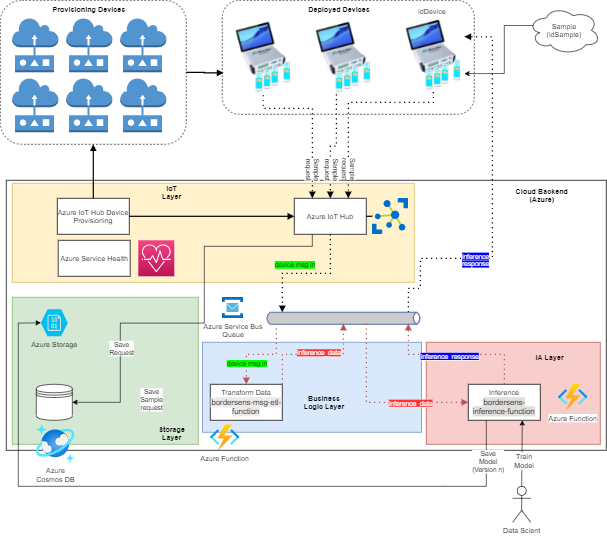
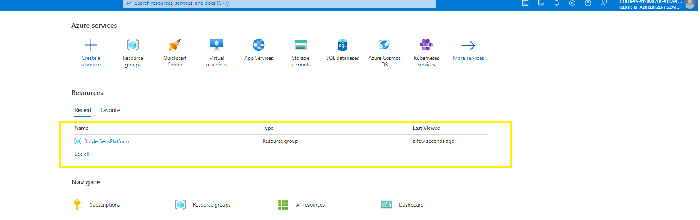
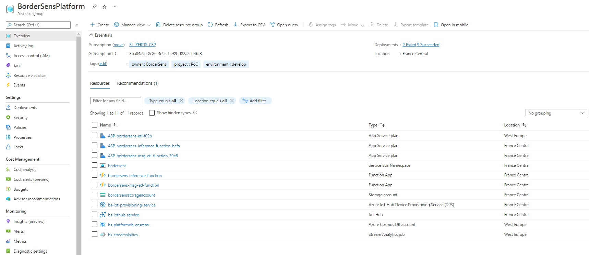
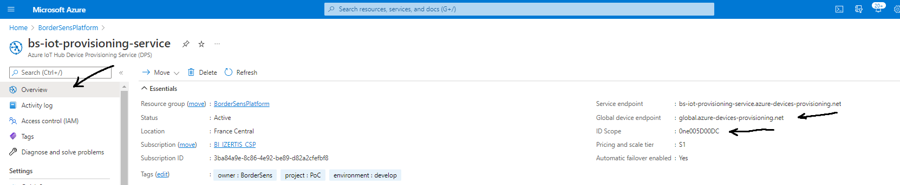
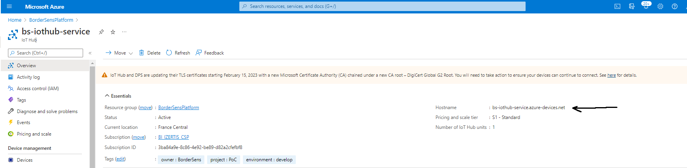

# Librería Java BorderSens SDK

## Contenido

En el presente repositorio, podemos encontrar el siguiente contenido:

- [BorderSensSDK](./BorderSensSDK): Proyecto java que contiene el código de la librería desarrollada para el contexto de uso en el proyecto BorderSens.
- [BorderSensSDK-2.0.1-jar-with-dependencies.jar](./BorderSensSDK-2.0.1-jar-with-dependencies.jar): Librería [BorderSensSDK](./BorderSensSDK) compilada en forma de jar, para poder ser usada en otros proyectos java.
- [BorderSensSDKTest](./BorderSensSDKTest): Proyecto de test que usa [BorderSensSDK-1.0.0-jar-with-dependencies.jar](./BorderSensSDK-2.0.1-jar-with-dependencies.jar) para interactuar con la librería y de esa forma servir como ejemplo de uso de la misma.

## Servicios de Azure

Los servicios Azure siguen el esquema propuesto en la arquitectura



Todos los servicios descritos para la plataforma bordersens, están desplegados en Azure, dentro del grupo de recursos **BorderSensPlarform**.

Se ha creado el siguiente usuario, para poder acceder a los mismos:

- **usuario:** bordersens@azurebiizertis.onmicrosoft.com
- **password:** XK_'T}JB&RBy

Para acceder a los servicios creados para el proyecto BorderSens, tenemos que acceder al grupo de recursos Bordersens



Y dentro veremos todos los recursos de este proyecto, que en el momento de la redacción de este documento, son los siguientes (aunque evolucionarán al menos con la construcción de la capa de IA)



A continuación se describirán brevemente los servicios Azure y  su rol dentro de la plataforma para dar contexto

### Azure IoT Hub

**Descripción:** Es el servicio de Azure  que sirve de punto de entrada entre la comunicación bidireccional a los dispositivos, y la plataforma, usando los mecanismos de autentificación y cifrado establecidos, en este caso certificados X509. De forma adicional este servicio se conecta a el Azure Service Bus, comentado mas adelante, iniciando de esta forma el flujo del dato a través de todos los servicios involucrados.

**Servicio en Azure:**  bs-iothub-service

### Azure IoT Hub Device Provisioning Service (DPS)

**Descripción:** Es el servicio de Azure  para gestionar los dispositivos conectados a Azure IoT Hub de una forma unificada y por lo tanto es el punto de acceso para el registro de un nuevo dispositivo.

**Servicio en Azure:**  bs-iot-provisioning-service

### Azure Cosmos DB

**Descripción:** Base de datos No-SQL (en forma de clave valor, muy similar a Cassandra), con altísima capacidad tanto en lectura como en escritura, donde se guardaran todos los registros relativos a el transito del dato por la plataforma.

**Servicio en Azure:**  bs-iot-provisioning-service

### Azure Service Bus

**Descripción:** Es el servicio de Azure  que sirve como cola de comunicación asíncrona entre el resto de servicios, y por lo tanto los interconecta, y dispara la creación de servicios serverless como las Azure Function.

**Servicio en Azure:**  bordersens

**Colas:** El sistema de comunicación usado son colas FIFO. Esto implica que los mensajes se consumen según su antigüedad (primero los mas antiguos) y se eliminan al ser consumidos, por lo que solo pueden procesarse 1 vez. En este caso la existencia de un nuevo mensaje en una cola disparara la activación de una Function, destinada a procesarlo. Esto hace que el sistema pueda tener una altísima escalabilidad, ya que no hay limite (o es altísimo) de Functions desplegadas en paralelo. Actualmente existen 3 colas:

- **device_msg_in:**  Esta cola es el punto de entrada a partir del cual los mensajes entrantes en el servicio Azure IoT Hub, son introducidos en la misma. Basicamente en esta cola podemos encontrar los mensajes en bruto generados por los dispositivos e ingestados por el servicio IoT Hub. Estos mensajes son procesados por la Function **bordersens-msg-etl-function**, que realiza las transformaciones de los datos, para adecuarlos al formato que espera la Function de inferencia **bordersens-inference-function**.
- **inference_data:**  Los datos procesados por la Function **bordersens-msg-etl-function** que realiza las transformaciones sobre los datos enviados por los sensores, son escritos en esta cola, y procesados por la Function **bordersens-inference-function** que realiza la inferencia.
- **inference_response:**  Los datos procesados por la Function **bordersens-inference-function**, es decir los resultados de el modelo de IA, que realiza la detección de drogas, son escritos en esta cola, que servirá para que una aplicación pueda mostrarlos.

### Azure Funtions

Las Functions, son los servicios serverless, activados asíncronamente por eventos (en este caso la introducción de un nuevo mensaje en una cola de el Azure Service Bus),  que manejan la lógica de negocio, necesaria para hacer las predicciones, a partir de los datos, enviados desde los dispositivos, y gestionar la respuesta.

La gran ventaja del uso de funtions, en un patrón de comunicación asíncrona, es la altísima escalabilidad de la solución y la tolerancia a fallos. 

Se ha buscado también encapsular la lógica de la aplicación en distintas function, de forma que se maximice la mantenibilidad, es decir solo tengamos que hacer cambios, en la function, en la cual queremos mejorar su lógica de negocio, sin afectar al resto.

En este caso (por el momento), se han creado 2 Functions, que se describirán a continuación:

##### Funtion para logica de ETL (bordersens-msg-etl-function)

Esta function encapsula la lógica de las transformaciones necesarias, a partir de los datos en crudo enviados por los sensores, para que estos puedan ser ingeridos por los modelos de IA para realizar la inferencia. La función es disparada, cada vez que un nuevo evento llega a la cola **device_msg_in** y el dato transformado es escrito en la cola **inference_data**, para que sea consumido por el modelo.

##### Funtion para Inferencia (bordersens-inference-function)

Esta function encapsula la lógica para realizar la inferencia a partir del modelo entrenado, consumiendo los datos disponibles en la cola **inference_data** y propagando los resultados en la cola **inference_response**.

## Uso de la librería BorderSens SDK

Para usar la librería, lo único que debemos hacer es usar el jar generado [BorderSensSDK-1.0.0-jar-with-dependencies.jar](./BorderSensSDK-1.0.0-jar-with-dependencies.jar).

Esta diseñada para gestionar la interacción con el servicio [Azure IoT Hub](#Azure IoT Hub) descrito anteriormente, y que actúa como punto de entrada de los   datos hacia la plataforma.

Para ello, a alto nivel ofrece 3, funcionalidades:

### Gestionar el alta de dispositivos (sensores) en la plataforma.

Esta funcionalidad busca interactuar con el servicio [Azure IoT Hub Device Provisioning Service (DPS)](#Azure IoT Hub Device Provisioning Service (DPS)) para dar de alta los sensores en la plataforma y a partir de este punto poder realizar envíos de muestras para obtener los resultados.

Es importante indicar que el proceso es idempotente, es decir, el resultado será el mismo (el alta del dispositivo en el sistema), independientemente del numero de veces que se invoque. Por ejemplo, si ya di de alta el dispositivo, e invoco esta funcionalidad, no habrá cambios en la plataforma.

Para poder dar de alta un dispositivo en la plataforma es necesario, haber generado los certificados apropiados para el dispositivo, para ello, se recomienda leer la documentación [Creación de certificados X509 autofirmados](../generación de certificados/Creación de certificados X509 autofirmados.md).

Recordando lo descrito en dicho documento, existen 3 niveles de jerarquía en los certificados.

 

- Certificado Root: Solo existe un **certificado root** por cada servicio IoT Hub. Dicho certificado ya se ha creado, y se ha asociado con el servicio IoT Hub.

  Podemos encontrarlo en el siguiente enlace: [Certificado Root](../generación de certificados/certificates/RootCA.pem) o en el [directorio de certificados](../generación de certificados/certificates/).

- Los **certificados intermedios** o intermediate son certificados, generados a partir del certificado root, y que sirven para firmar cualquier numero de certificados de dispositivo. Dentro del servicio [Azure IoT Hub Device Provisioning Service (DPS)](#Azure IoT Hub Device Provisioning Service (DPS)) permiten agrupar los dispositivos en grupos lógicos, bajo un único certificado firmante (el certificado intermedio). Esto para el proyecto tiene sentido por ejemplo en el caso de uso de un determinado aeropuerto, de forma que cada aeropuerto pueda generar su propio grupo, y asociar su propio certificado, y a partir de aquí, generar tantos certificados de dispositivo, como sean necesarios.

  Para poder usar un certificado intermedio, es necesario haberlo generado anteriormente, y asociarlo a un determinado grupo en el servicio  [Azure IoT Hub Device Provisioning Service (DPS)](#Azure IoT Hub Device Provisioning Service (DPS)), tal y como se describe en el documento [Creación de certificados X509 autofirmados](../generación de certificados/Creación de certificados X509 autofirmados.md).

- Los **certificados de dispositivo** o leaf, son los certificados que identifican y autorizan inequívocamente a un determinado dispositivo en el servicio [Azure IoT Hub](#Azure IoT Hub). Estos certificados, han de haberse generado a partir de un certificado intermedio, perteneciente a un grupo, que se haya dado de alta como tal en el servicio [Azure IoT Hub Device Provisioning Service (DPS)](#Azure IoT Hub Device Provisioning Service (DPS)) .

El proceso que describimos en esta sección, puede ser usado, en el supuesto de haber cumplido todos los requisitos anteriormente expuestos, es decir, que se haya dado de alta el certificado root en el servicio [Azure IoT Hub](#Azure IoT Hub) (actualmente el certificado Root disponible el [directorio de certificados](../generación de certificados/certificates/) ya esta dado de alta en el servicio) y que exista un grupo en el servicio [Azure IoT Hub Device Provisioning Service (DPS)](#Azure IoT Hub Device Provisioning Service (DPS)), que use el certificado intermedio (Intermediate1-bs-group.pem) disponible en el [directorio de certificados](../generación de certificados/certificates/), y por último, disponer de los certificados públicos y privados del dispositivo , generado con el certificado intermedio (en este caso se facilitan los certificados de dispositivo **device-1-bs-public.pem** y **device-1-bs-private.pem**)

Para poder conectar con el servicio [Azure IoT Hub Device Provisioning Service (DPS)](#Azure IoT Hub Device Provisioning Service (DPS)), necesitamos dos parámetros, que podemos obtener del propio servicio



Dentro del servicio, el la sección overview, podemos ver ambos parámetros, y sus valores actuales:

- Global device endpoint: **global.azure-devices-provisioning.net**
- ID Scope: **0ne005D00DC**

Para realizar el alta del dispositivo, usando la SDK, podemos usar el siguiente código de ejemplo disponible en el repositorio [BorderSensSDKTest](./BorderSensSDKTest), específicamente en la clase **DoRegisterDevice**.

```java
String idScope = "0ne005D00DC";
String globalEndpoint = "global.azure-devices-provisioning.net";
IoTConnectionDeviceService rds  = new IoTConnectionDeviceServiceImpl(idScope,globalEndpoint);
try
{

    String certificatesPath = "C:\\Users\\danie\\repositorios\\BorderSens\\create-certificates\\azure-iot-sdk-c\\tools\\CACertificates"; // Ruta a la carpeta de los certificados
    String publicCertificate = certificatesPath + "\\device-1-bs-public.pem"; // Certificado público del dispositivo
    String privateCertificate = certificatesPath + "\\device-1-bs-private.pem"; // Certificado privado del dispositivo
    String intermediateCertificate = certificatesPath + " \\ Certificado intermedio del grupo al que asociamos el dispositivo;
    ProvisioningStatus provisioningStatus = rds.registerDeviceWithIntermediate(publicCertificate,privateCertificate,intermediateCertificate);
    if (provisioningStatus!=null && provisioningStatus.isProvisioned()) {
        System.out.println("Registered device");
    } else {
        System.out.println("No registered device");
    }
} catch (Exception e) {
    e.printStackTrace();
}
```

En el objeto **ProvisioningStatus** de la SDK, tenemos el estado de la vinculación.

### Gestionar el envío de mensajes hacia la plataforma.

Este caso de uso, **el dispositivo envía datos a la plataforma**, por medio del servicio [Azure IoT Hub](#Azure IoT Hub).

Idealmente, los datos de medidas captados por los sensores.

Para que el servicio acepte los datos, es necesario haber dado de alta el dispositivo, tal y como se describe en el [paso anterior](#Gestionar el alta de dispositivos (sensores) en la plataforma.)

Para hacerlo, necesitamos 2 parámetros:

- **Host name del servicio Azure IoT Hub**: Que podemos obtener del **overview** del servicio IoT Hub. Según lo configurado el parámetro actual es **bs-iothub-service.azure-devices.net**

  

- **id del dispositivo:** Que es el **commun name** del certificado asociado al dispositivo, que pasamos como parámetro en el momento de crear el certificado. Podemos verlo sobre un certificado existente pegando el contenido de el certificado público del dispositivo en este [decodificador online](https://www.sslchecker.com/certdecoder). Para los certificados adjuntos, en id del dispositivo es **device-1-bs**

Para enviar un mensaje desde el dispositivo, usando la SDK, podemos usar el siguiente código de ejemplo disponible en el repositorio [BorderSensSDKTest](./BorderSensSDKTest) , específicamente en la clase **SendMessage**.

```java
String iothubUri = "bs-iothub-service.azure-devices.net";
String idDevice = "device-1-bs";
Semaphore mutex = new Semaphore(1); // Semaforo para gestionar la espera
try
{
    String certificatesPath = "C:\\Users\\danie\\repositorios\\BorderSens\\create-certificates\\azure-iot-sdk-c\\tools\\CACertificates"; // Path hacia la ruta de los certificados
    String publicCertificate = certificatesPath + "\\device-1-bs-public.pem"; // Certificado público del dispositivo
    String privateCertificate = certificatesPath + "\\device-1-bs-private.pem"; // Certificado privado del dispositivo
    SecurityProvider securityProvider = 			IoTConnectionDeviceServiceImpl.getSecurityProviderX509(publicCertificate,privateCertificate); // Llamada para autentificacion

    // Json del objeto que queremos enviar por mensaje
    JSONObject jMessage = new JSONObject(getRandomSample());
    jMessage.put("date",new SimpleDateFormat("yyyy-MM-dd HH:mm:ss.sss").format(new Date()));
    jMessage.put("value", UUID.randomUUID().toString());
    jMessage.put("sensor", idDevice);
    
    // Instancia para el servicio de gestion de mensajes
    IoTMessagesHandlerServiceImpl messagesHandlerService = IoTMessagesHandlerServiceImpl.getInstance();
    final boolean[] send = {false};
    mutex.acquire();

    Timer timer = new Timer(4000,
                            (ActionListener) e -> mutex.release());
    timer.start(); // Temporizador para abortar, si no se ha recibido ningun mensaje

    // Invocacion para enviar un mensaje, pasando Callback al obtener respuesta del envio
    messagesHandlerService.sendMessageMQTT(securityProvider, iothubUri, idDevice, jMessage.toString(), new MessageSentCallback()
                                           {
                                               @Override
                                               public void onMessageSent(Message sentMessage, IotHubClientException clientException, Object callbackContext)
                                               {
                                                   System.out.println("Message sent!");
                                                   send[0] = true;
                                                   mutex.release();

                                               }
                                           });
    mutex.acquire();
    System.out.println("Saliendo");
    messagesHandlerService.stopCloudMessagesListener();

} catch (Exception e) {
    e.printStackTrace();
}
```

Existe alguna función auxiliar en el ejemplo, que se puede ver en el código completo del repositorio [BorderSensSDKTest](./BorderSensSDKTest)

Para mejorar la comprensión de las acciones de la SDK, y abstraerlo del resto del código, a continuación se enumeraran las acciones mas significativas:

- **Autentificación** del dispositivo en la plataforma

  ```java
  /*
   * Llamada al método estatico getSecurityProviderX509 del servicio IoTConnectionDeviceServiceImpl, con los siguientes párametros:
   * - publicCertificate: Ruta al certificado público del dispositivo
   * - privateCertificate: Ruta al certificado privado del dispositivo
   */
  SecurityProvider securityProvider = 			IoTConnectionDeviceServiceImpl.getSecurityProviderX509(publicCertificate,privateCertificate); // Llamada para autentificacion
  ```

  

- Obtención de instancia del servicio **IoTMessagesHandlerServiceImpl**, para enviar mensajes

  ```
  IoTMessagesHandlerServiceImpl messagesHandlerService = IoTMessagesHandlerServiceImpl.getInstance();
  ```

  

- Envío de mensaje

  ```
  messagesHandlerService.sendMessageMQTT(
  	securityProvider, // Security Provider obtenido tras la autentificación
  	iothubUri, // Host del servicio Azure IoT Hub
  	idDevice, // Id del dispositivo (Commun name del certificado del dispositivo)
  	jMessage.toString(), // Json del mensaje en formato String
  	new MessageSentCallback(){ // Callback invocado al ser enviado el mensaje
          @Override
          public void onMessageSent(Message sentMessage, IotHubClientException clientException, Object callbackContext)
          {
          System.out.println("Message sent!");
  		}
  	}
  );
  ```

  

- Cierre de la conexión con el servicio **IoTMessagesHandlerServiceImpl**: Esto es conveniente, por que en otro caso, cualquier respuesta del mensajes recibidos con éxito, seguirá propagándose hacia el listener

  ```
  messagesHandlerService.stopCloudMessagesListener();
  ```

  

### Gestionar la recepción de mensajes desde la plataforma.

Este caso de uso, es necesario para recibir mensajes **desde la plataforma hacia el dispositivo**, por ejemplo, para obtener respuesta de el resultado del modelo de ML, tras recibir los datos, podemos usar el siguiente código de ejemplo disponible en el repositorio [BorderSensSDKTest](./BorderSensSDKTest) , específicamente en la clase **ReciveMessageFromCloud**.

```java
import com.microsoft.azure.sdk.iot.device.*;
import com.microsoft.azure.sdk.iot.device.exceptions.IotHubClientException;
import com.microsoft.azure.sdk.iot.device.transport.IotHubConnectionStatus;
import com.microsoft.azure.sdk.iot.provisioning.security.SecurityProvider;
import model.Counter;
import services.impl.IoTConnectionDeviceServiceImpl;

import java.io.IOException;
import java.net.URISyntaxException;
import java.security.cert.CertificateException;

public class ReciveMessageFromCloud {

    // Esta clase sera llamada al recibir un nuevo mensaje desde la plataforma
    protected static class MessageCallbackMqtt implements com.microsoft.azure.sdk.iot.device.MessageCallback
    {
        public IotHubMessageResult onCloudToDeviceMessageReceived(Message msg, Object context)
        {
            Counter counter = (Counter) context;
            System.out.println(
                    "Received message " + counter.toString()
                            + " with content: " + new String(msg.getBytes(), Message.DEFAULT_IOTHUB_MESSAGE_CHARSET));
            for (MessageProperty messageProperty : msg.getProperties())
            {
                System.out.println(messageProperty.getName() + " : " + messageProperty.getValue());
            }

            counter.increment();

            return IotHubMessageResult.COMPLETE;
        }
    }

    // Esta clase sera llamada al cambiar el estado de la conexión
    protected static class IotHubConnectionStatusChangeCallbackLogger implements IotHubConnectionStatusChangeCallback
    {
        @Override
        public void onStatusChanged(ConnectionStatusChangeContext connectionStatusChangeContext)
        {
            IotHubConnectionStatus status = connectionStatusChangeContext.getNewStatus();
            IotHubConnectionStatusChangeReason statusChangeReason = connectionStatusChangeContext.getNewStatusReason();
            Throwable throwable = connectionStatusChangeContext.getCause();

            System.out.println();
            System.out.println("CONNECTION STATUS UPDATE: " + status);
            System.out.println("CONNECTION STATUS REASON: " + statusChangeReason);
            System.out.println("CONNECTION STATUS THROWABLE: " + (throwable == null ? "null" : throwable.getMessage()));
            System.out.println();

            if (throwable != null)
            {
                throwable.printStackTrace();
            }

            if (status == IotHubConnectionStatus.DISCONNECTED)
            {
                System.out.println("The connection was lost, and is not being re-established." +
                        " Look at provided exception for how to resolve this issue." +
                        " Cannot send messages until this issue is resolved, and you manually re-open the device client");
            }
            else if (status == IotHubConnectionStatus.DISCONNECTED_RETRYING)
            {
                System.out.println("The connection was lost, but is being re-established." +
                        " Can still send messages, but they won't be sent until the connection is re-established");
            }
            else if (status == IotHubConnectionStatus.CONNECTED)
            {
                System.out.println("The connection was successfully established. Can send messages.");
            }
        }
    }

    // Clase MAin
    public static void main(String[] args) {
        String iothubUri = "bs-iothub-service.azure-devices.net"; // Host del servicio IoT Hub
        String idDevice = "device-1-bs"; // Id del dispositivo = Commun Name del certificado del dispositivo
        DeviceClient deviceClient = null; // Cliente del dispositivo
        try
        {
            // Rutas a los certificados del dispositivo
            String certificatesPath = "C:\\Users\\danie\\repositorios\\BorderSens\\create-certificates\\azure-iot-sdk-c\\tools\\CACertificates";
            String publicCertificate = certificatesPath + "\\device-1-bs-public.pem";//"/new-device-01.cert.pem";
            String privateCertificate = certificatesPath + "\\device-1-bs-private.pem";//"/new-device-01.key.pem";
            
            // Security provider para los certificados
            SecurityProvider securityProvider = IoTConnectionDeviceServiceImpl.getSecurityProviderX509(publicCertificate,privateCertificate); // Security Provider
            
            // Instanciacion del DeviceClient
            deviceClient = new DeviceClient(
                iothubUri, // Host del servicio IoT Hub
                idDevice, // Id del dispositivo
                securityProvider, // Security provider 
                IotHubClientProtocol.MQTT // PRotocolo de recepción
            );

            System.out.println("Successfully created an IoT Hub client.");
            MessageCallbackMqtt callback = new MessageCallbackMqtt(); // Calback para los mensajes
            Counter counter = new Counter(0);
            deviceClient.setMessageCallback(callback, counter); // Asiciacion del Callback de recepcion de mensaje con el DeviceClient
            System.out.println("Successfully set message callback.");

            // Asiciacion del Callback de cambio de estado en la conexión con el DeviceClient
            deviceClient.setConnectionStatusChangeCallback(new IotHubConnectionStatusChangeCallbackLogger(), new Object());

            deviceClient.open(false); // Apertura de la conexion para recivir mensajes

            System.out.println("Opened connection to IoT Hub.");
            System.out.println("Beginning to receive messages...");

            // Wait for IoT Hub to respond.
            try
            {
                Thread.sleep(1000000);
            }
            catch (InterruptedException e)
            {
                e.printStackTrace();
            }


        } catch (IOException e)
        {
            e.printStackTrace();
            if (deviceClient != null)
            {
                deviceClient.close();
            }
        }
        catch (IotHubClientException e)
        {
            e.printStackTrace();
            if (deviceClient != null)
            {
                deviceClient.close();
            }
        }
        catch (CertificateException e)
        {
            e.printStackTrace();
        }
    }
}
```

Para probar el envío de mensajes, se puede usar el servicio [Azure IoT Explorer](https://docs.microsoft.com/es-es/azure/iot-fundamentals/howto-use-iot-explorer).

### Envío de mensajes sincronos hacia la plataforma.

Este caso de uso, este método de la SDK, permite el envio de mensajes hacia la plataforma, y la gestión de la respuesta, de forma que desde el punto de vista del serivicio que lo invoca, se comporta como un servicio **sincrono**.


Para mejorar la comprensión de las acciones de la SDK, y abstraerlo del resto del código, a continuación se enumeraran las acciones mas significativas:

- **Autentificación** del dispositivo en la plataforma

  ```
    /*
     * Llamada al método estatico getSecurityProviderX509 del servicio IoTConnectionDeviceServiceImpl, con los siguientes párametros:
     * - publicCertificate: Ruta al certificado público del dispositivo
     * - privateCertificate: Ruta al certificado privado del dispositivo
     */
    SecurityProvider securityProvider = 			IoTConnectionDeviceServiceImpl.getSecurityProviderX509(publicCertificate,privateCertificate); // Llamada para autentificacion
  ```

  

  

- Obtención de instancia del servicio **IoTMessagesHandlerServiceImpl**, para enviar mensajes

  ```
  IoTMessagesHandlerServiceImpl messagesHandlerService = IoTMessagesHandlerServiceImpl.getInstance();
  ```

  

- Envío de mensaje y recepción sincrona

  ```
  Map<String,Object> response = messagesHandlerService.sendSyncMessage(securityProvider, iothubUri, idDevice, jMessage.toString(), 40000);
  ```
  
  

